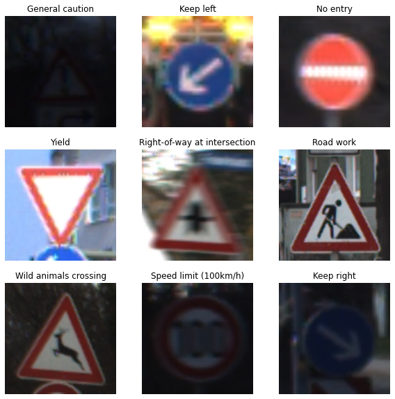
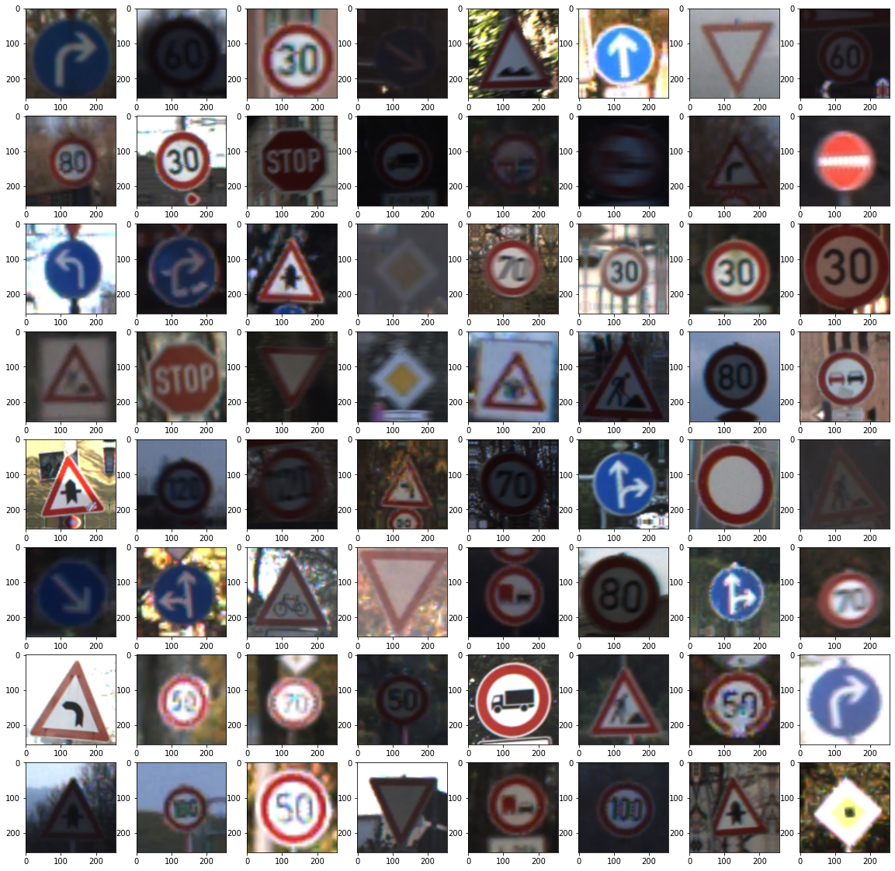
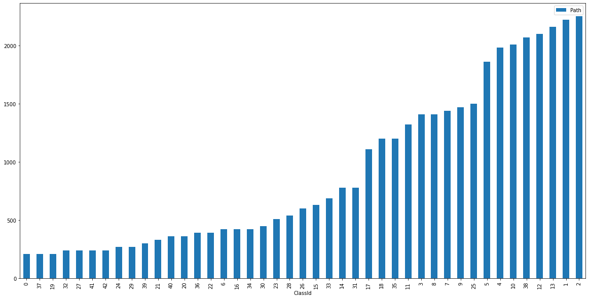
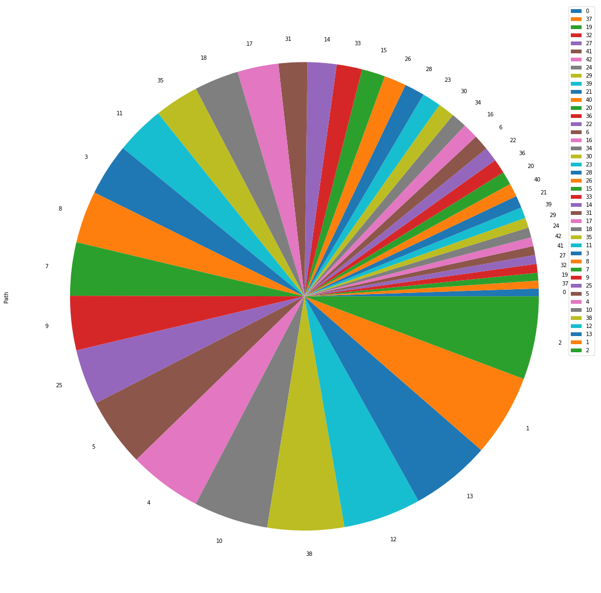
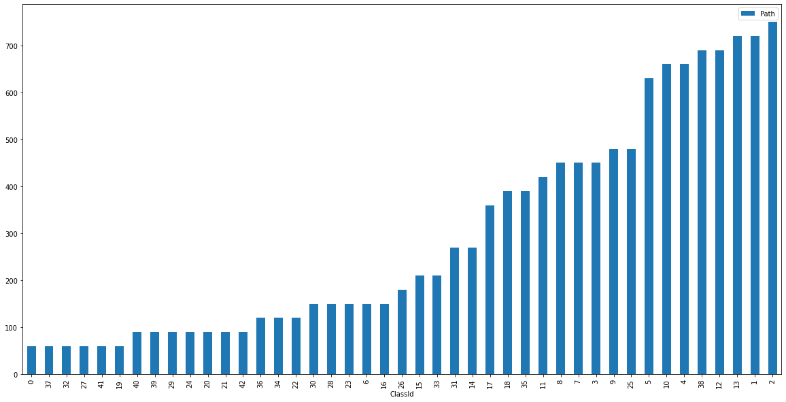
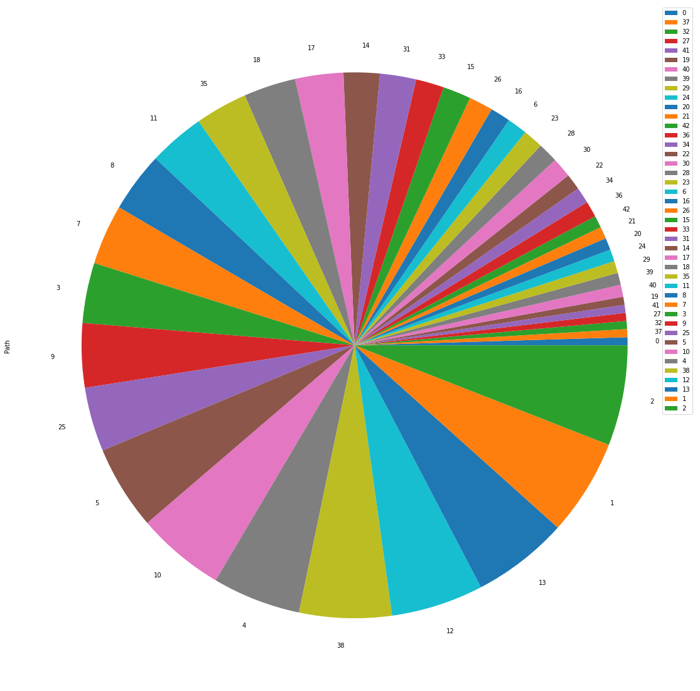
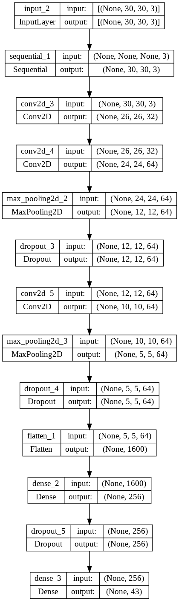
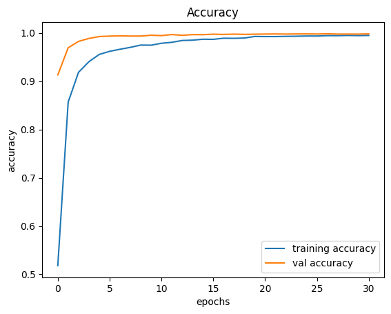
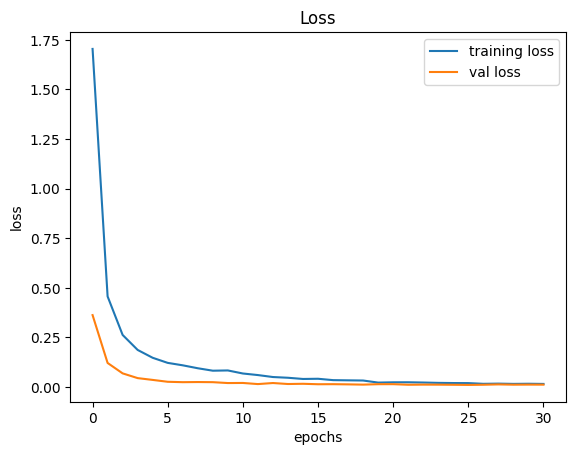
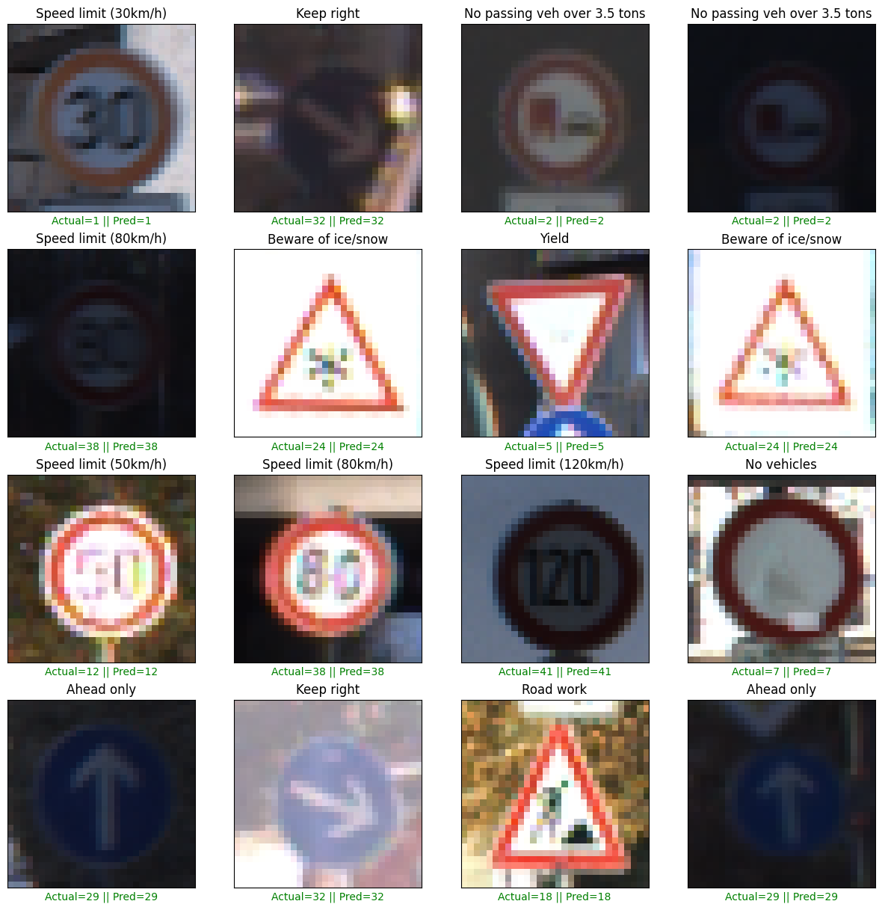

<div style="position: absolute; top: 0; right: 0;">
    <a href="ertugrulbusiness@gmail.com"></a>
    <a href="https://tr.linkedin.com/in/ertu%C4%9Fruldemir?original_referer=https%3A%2F%2Fwww.google.com%2F"></a>
    <a href="https://github.com/ertugruldmr"></a>
    <a href="https://www.kaggle.com/erturuldemir"></a>
    <a href="https://huggingface.co/ErtugrulDemir"></a>
    <a href="https://stackoverflow.com/users/21569249/ertu%c4%9frul-demir?tab=profile"></a>
    <a href="https://medium.com/@ertugrulbusiness"></a>
    <a href="https://www.youtube.com/channel/UCB0_UTu-zbIsoRBHgpsrlsA"></a>
</div>

# Traffic Sign Image Classification
 
## __Table Of Content__
- (A) [__Brief__](#brief)
  - [__Project__](#project)
  - [__Data__](#data)
  - [__Demo__](#demo) -> [Live Demo]()
  - [__Study__](#problemgoal-and-solving-approach) -> [Colab]()
  - [__Results__](#results)
- (B) [__Detailed__](#Details)
  - [__Abstract__](#abstract)
  - [__Explanation of the study__](#explanation-of-the-study)
    - [__(A) Dependencies__](#a-dependencies)
    - [__(B) Dataset__](#b-dataset)
    - [__(C) Modelling__](#e-modelling)
    - [__(D) Deployment as web demo app__](#g-deployment-as-web-demo-app)
  - [__Licance__](#license)
  - [__Connection Links__](#connection-links)

## __Brief__ 

### __Project__ 
- This is a __classification__ project that uses the  [__Traffic Signs dataset__](https://www.kaggle.com/datasets/meowmeowmeowmeowmeow/gtsrb-german-traffic-sign) to __classify the images__ .
- The __goal__ is build a deep learning image classification model that accurately __classifying the images__ into corresponding traffic sign class based on the features. 
- The performance of the model is evaluated using several __metrics__ loss and accuracy metrics.

#### __Overview__
- This project involves building a deep learning model to classfy the images. The dataset contains 51.839 images with 43 class. 31.368 train 7.841 validation and 12.630 test. The models selected according to model tuning results, the progress optimized respectively the previous tune results. The project uses Python and several popular libraries such as Pandas, NumPy, tensorflow.

#### __Demo__

<div align="left">
  <table>
    <tr>
    <td>
        <a target="_blank" href="" height="30">[Demo app] HF Space</a>
      </td>
      <td>
        <a target="_blank" href="">[Demo app] Run in Colab</a>
      </td>
      <td>
        <a target="_blank" href="">[Traning pipeline] source on GitHub</a>
      </td>
    <td>
        <a target="_blank" href="">[Traning pipeline] Run in Colab</a>
      </td>
    </tr>
  </table>
</div>


- Description
    - __classify the images__ .
    - __Usage__: Set the feature values through sliding the radio buttons then use the button to predict.
- Embedded [Demo]() window from HuggingFace Space
    

<iframe
	src=""
	frameborder="0"
	width="850"
	height="450"
></iframe>

#### __Data__
- The [__Traffic Signs dataset__](https://www.kaggle.com/datasets/meowmeowmeowmeowmeow/gtsrb-german-traffic-sign) from kaggle platform.
- The dataset contains 51.839 images with 43 class. 31.368 train 7.841 validation and 12.630 test.
- The dataset contains the following features:

  - Example Dataset
      <div style="text-align: center;">
        
      </div>
  - Data Augmentation
      <div style="text-align: center;">
        
      </div>


#### Problem, Goal and Solving approach
- This is a __Image classification__ problem  that uses the  [__Traffic Signs dataset__](https://www.kaggle.com/datasets/meowmeowmeowmeowmeow/gtsrb-german-traffic-sign)  to __classfy the traffic sign images__.
- The __goal__ is to build a model that accurately ___classfy the traffic sign images__ into corresponding traffic sign class.
- __Solving approach__ is that using the supervised deep learning models. A basic custom conv model is used. 

#### Study
The project aimed predict the house prices using the features. The study includes following chapters.
- __(A) Dependencies__: Installations and imports of the libraries.
- __(B) Dataset__: Downloading and loading the dataset. Preparing the dataset via tensorflow dataset api. Configurating the dataset performance and related pre-processes. Implementing augmentation methods on train dataset.
- __(C) Modelling__: It includes following subsections.
  - Archirecture
    - Custom Convolutional Deep learning model as classifier.
  - Training
    - Declerating the callbacks then training the model using the prepared data with determinated hyperparams.
  - Predicting
    - Implementing the model on the example data, inferencing.
  - Evaluating
    - Saving the model architecture with weights.
- __(D) Deployment as web demo app__: Creating Gradio Web app to Demostrate the project.Then Serving the demo via huggingface as live.

#### results
- The final model is __Custom Classifier Network__ because of the results and less complexity.
  - Custom Conv Neural Network Classfier Results
        <table><tr><th>Classification Results </th><th></th></tr><tr><td>
      | model                         | loss   | accuracy |
      |-------------------------------|--------|----------|
      | [Train] Custom Classifier     | 0.0122 | 0.9980   |
      | [Test] Custom Classifier      | 0.0904 | 0.9797   |
      </td></tr></table>
  - Custom Conv Neural Network Classfier Classification Results    
    <table><tr><th>Classification Report </th><th></th></tr><tr><td>
  | classes | precision | recall | f1-score | support |
  |--------|-----------|--------|----------|---------|
  | 0      | 0.98      | 1.00   | 0.99     | 60      |
  | 1      | 0.99      | 0.99   | 0.99     | 720     |
  | 2      | 1.00      | 1.00   | 1.00     | 660     |
  | 3      | 0.96      | 0.98   | 0.97     | 420     |
  | 4      | 1.00      | 0.99   | 0.99     | 690     |
  | 5      | 1.00      | 1.00   | 1.00     | 720     |
  | 6      | 1.00      | 1.00   | 1.00     | 270     |
  | 7      | 0.98      | 1.00   | 0.99     | 210     |
  | 8      | 1.00      | 0.99   | 1.00     | 150     |
  | 9      | 1.00      | 1.00   | 1.00     | 360     |
  | 10     | 0.97      | 0.91   | 0.94     | 390     |
  | 11     | 0.95      | 1.00   | 0.98     | 60      |
  | 12     | 0.97      | 0.99   | 0.98     | 750     |
  | 13     | 0.87      | 1.00   | 0.93     | 90      |
  | 14     | 0.87      | 0.81   | 0.84     | 90      |
  | 15     | 1.00      | 0.96   | 0.98     | 120     |
  | 16     | 0.89      | 1.00   | 0.94     | 150     |
  | 17     | 0.92      | 0.97   | 0.94     | 90      |
  | 18     | 0.98      | 0.96   | 0.97     | 480     |
  | 19     | 0.92      | 0.93   | 0.92     | 180     |
  | 20     | 0.57      | 0.52   | 0.54     | 60      |
  | 21|0.99|0.99|0.99|150|
  | 22|0.91|1.00|0.95|90|
  | 23|1.00|0.95|0.97|450|
  | 24|0.93|0.85|0.89|150|
  | 25|0.99|1.00|0.99|270|
  | 26|0.98|1.00|0.99|60|
  | 27|0.99|1.00|1.00|210|
  | 28|1.00|0.99|1.00|120|
  | 29|1.00|1.00|1.00|390|
  | 30|1.00|0.99|1.00|120|
  | 31|0.98|0.98|0.98|60|
  | 32|0.99|1.00|0.99|690|
  | 33|0.98|0.97|0.97|90|
  | 34|1.00|0.98|0.99|660|
  | 35|0.97|1.00|0.98|90|
  | 36|1.00|1.00|1.00|60|
  | 37|0.97|1.00|0.98|90|
  | 38|0.96|0.97|0.96|630|
  | 39|1.00|0.95|0.97|150|
  | 40|0.99|0.99|0.99|450|
  | 41|0.98|1.00|0.99|450|
  | 42|1.00|1.00|1.00|450|
    </td></tr></table>

## Details

### Abstract
- [__MNIST dataset__](https://www.tensorflow.org/datasets/catalog/mnist) is used to classfy the traffic sign images into corresponding class. The dataset has 51.839 images with 43 class. 31.368 train 7.841 validation and 12.630 test. The problem is supervised learning task as image classification. The goal is classifying the traffic sign images into corresponding class using  through supervised custom deep learning algorithms.The study includes creating the environment, getting the data, preprocessing the data, exploring the data, agumenting the data, modelling the data, saving the results, deployment as demo app. Training phase of the models implemented through tensorflow callbacks. Selected the basic and more succesful model. Tuned __Custom Classifier Convolutional Neural Network__ model has __0.0904__ loss , __0.9797__ acc,  other metrics are also found the results section. Created a demo at the demo app section and served on huggingface space.  


### File Structures

- File Structure Tree
```bash
├── demo_app
│   ├── app.py
│   ├── custom_conv_model
│   │   ├── assets
│   │   ├── fingerprint.pb
│   │   ├── keras_metadata.pb
│   │   ├── saved_model.pb
│   │   └── variables
│   │       ├── variables.data-00000-of-00001
│   │       └── variables.index
│   └── sample_images
├── docs
│   └── images
├── env
│   ├── env_installation.md
│   └── requirements.txt
├── LICENSE
├── readme.md
├── requirements.txt
└── study.ipynb
```
- Description of the files
  - demo_app/
    - Includes the demo web app files, it has the all the requirements in the folder so it can serve on anywhere.
  - demo_app/component_configs.json :
    - It includes the web components to generate web page.
  - demo_app/custom_conv_model:
    - The trained custom fully connected neural network model.
  - demo_app/requirements.txt
    - It includes the dependencies of the demo_app.
  - docs/
    - Includes the documents about results and presentations
  - env/
    - It includes the training environmet related files. these are required when you run the study.ipynb file.
  - LICENSE.txt
    - It is the pure apache 2.0 licence. It isn't edited.
  - readme.md
    - It includes all the explanations about the project
  - study.ipynb
    - It is all the studies about solving the problem which reason of the dataset existance.    


### Explanation of the Study
#### __(A) Dependencies__:
  - The libraries which already installed on the environment are enough. You can create an environment via env/requirements.txt. Create a virtual environment then use hte following code. It is enough to satisfy the requirements for runing the study.ipynb which training pipeline.
  - Dataset can download from tensoflow.
#### __(B) Dataset__: 
  - Downloading the [__Traffic Signs dataset__](https://www.kaggle.com/datasets/meowmeowmeowmeowmeow/gtsrb-german-traffic-sign) via tensorflow dataset api. 
  - The dataset contains 51.839 images with 43 class. 31.368 train 7.841 validation and 12.630 test.
  - Preparing the dataset via resizing, scaling into 0-1 value range, implementing data augmentation and etc image preprocessing processes. 
  - Creating the tensorflow dataset object then configurating.
  - Example Dataset
      <div style="text-align: center;">
        
      </div>
  - Data Augmentation
      <div style="text-align: center;">
        
      </div>
  - Class Distributions
    - Training dataset
        <div style="text-align: center;">
          
          
        </div>
      - Test dataset
        <div style="text-align: center;">
          
          
        </div>


#### __(C) Modelling__: 
  - The processes are below:
    - Archirecture
      - Custom Convolutional Deep learning model as classifier.
        <div style="text-align: center;">
          
        </div>
    - Training
      - Declerating the callbacks then training the model using the prepared data with determinated hyperparams.
        <div style="text-align: center;">
          
          
        </div>
    - Predicting
      - Implementing the model on the example data, inferencing.
        <div style="text-align: center;">
          
        </div>
    - Evaluating and classification results
      - Custom Conv Neural Network Classfier Results
        <table><tr><th>Classification Report </th><th></th></tr><tr><td>
      | model                         | loss   | accuracy |
      |-------------------------------|--------|----------|
      | [Train] Custom Classifier     | 0.0122 | 0.9980   |
      | [Test] Custom Classifier      | 0.0904 | 0.9797   |
        </td></tr></table>

        <table><tr><th>Classification Report </th><th></th></tr><tr><td>
    | classes | precision | recall | f1-score | support |
    |--------|-----------|--------|----------|---------|
    | 0      | 0.98      | 1.00   | 0.99     | 60      |
    | 1      | 0.99      | 0.99   | 0.99     | 720     |
    | 2      | 1.00      | 1.00   | 1.00     | 660     |
    | 3      | 0.96      | 0.98   | 0.97     | 420     |
    | 4      | 1.00      | 0.99   | 0.99     | 690     |
    | 5      | 1.00      | 1.00   | 1.00     | 720     |
    | 6      | 1.00      | 1.00   | 1.00     | 270     |
    | 7      | 0.98      | 1.00   | 0.99     | 210     |
    | 8      | 1.00      | 0.99   | 1.00     | 150     |
    | 9      | 1.00      | 1.00   | 1.00     | 360     |
    | 10     | 0.97      | 0.91   | 0.94     | 390     |
    | 11     | 0.95      | 1.00   | 0.98     | 60      |
    | 12     | 0.97      | 0.99   | 0.98     | 750     |
    | 13     | 0.87      | 1.00   | 0.93     | 90      |
    | 14     | 0.87      | 0.81   | 0.84     | 90      |
    | 15     | 1.00      | 0.96   | 0.98     | 120     |
    | 16     | 0.89      | 1.00   | 0.94     | 150     |
    | 17     | 0.92      | 0.97   | 0.94     | 90      |
    | 18     | 0.98      | 0.96   | 0.97     | 480     |
    | 19     | 0.92      | 0.93   | 0.92     | 180     |
    | 20     | 0.57      | 0.52   | 0.54     | 60      |
    | 21|0.99|0.99|0.99|150|
    | 22|0.91|1.00|0.95|90|
    | 23|1.00|0.95|0.97|450|
    | 24|0.93|0.85|0.89|150|
    | 25|0.99|1.00|0.99|270|
    | 26|0.98|1.00|0.99|60|
    | 27|0.99|1.00|1.00|210|
    | 28|1.00|0.99|1.00|120|
    | 29|1.00|1.00|1.00|390|
    | 30|1.00|0.99|1.00|120|
    | 31|0.98|0.98|0.98|60|
    | 32|0.99|1.00|0.99|690|
    | 33|0.98|0.97|0.97|90|
    | 34|1.00|0.98|0.99|660|
    | 35|0.97|1.00|0.98|90|
    | 36|1.00|1.00|1.00|60|
    | 37|0.97|1.00|0.98|90|
    | 38|0.96|0.97|0.96|630|
    | 39|1.00|0.95|0.97|150|
    | 40|0.99|0.99|0.99|450|
    | 41|0.98|1.00|0.99|450|
    | 42|1.00|1.00|1.00|450|
      </td></tr></table>


    - Saving the project and demo studies.
     - trained model __custom_conv_model__ as pickle format.

#### __(D) Deployment as web demo app__: 
  - Creating Gradio Web app to Demostrate the project.Then Serving the demo via huggingface as live.
  - Desciption
    - Project goal is classifiying the images into numbers.
    - Usage: upload or select the image for classfying then use the button to predict.
  - Demo
    - The demo app in the demo_app folder as an individual project. All the requirements and dependencies are in there. You can run it anywhere if you install the requirements.txt.
    - You can find the live demo as huggingface space in this [demo link]() as full web page or you can also us the [embedded demo widget](#demo)  in this document.  
    
## License
- This project is licensed under the Apache 2.0 License. See the [LICENSE](LICENSE) file for details.

<h1 style="text-align: center;">Connection Links</h1>

<div style="text-align: center;">
    <a href="ertugrulbusiness@gmail.com"></a>
    <a href="https://tr.linkedin.com/in/ertu%C4%9Fruldemir?original_referer=https%3A%2F%2Fwww.google.com%2F"></a>
    <a href="https://github.com/ertugruldmr"></a>
    <a href="https://www.kaggle.com/erturuldemir"></a>
    <a href="https://huggingface.co/ErtugrulDemir"></a>
    <a href="https://stackoverflow.com/users/21569249/ertu%c4%9frul-demir?tab=profile"></a>
    <a href="https://www.hackerrank.com/ertugrulbusiness"></a>
    <a href="https://app.patika.dev/ertugruldmr"></a>
    <a href="https://medium.com/@ertugrulbusiness"></a>
    <a href="https://www.youtube.com/channel/UCB0_UTu-zbIsoRBHgpsrlsA"></a>
</div>

